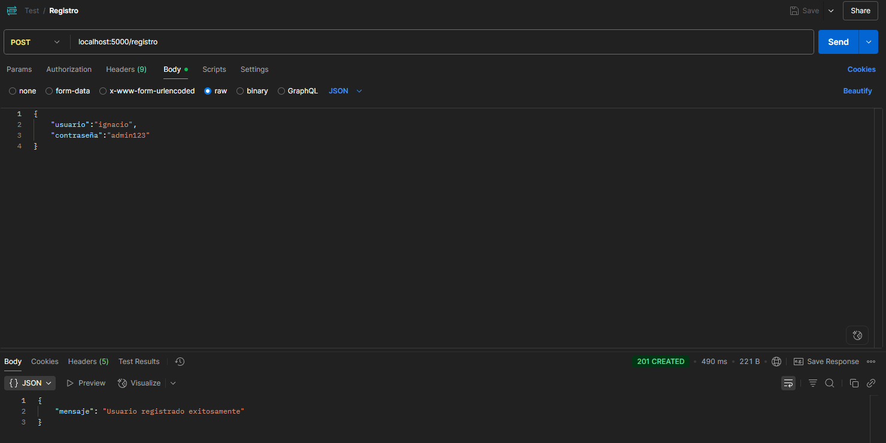
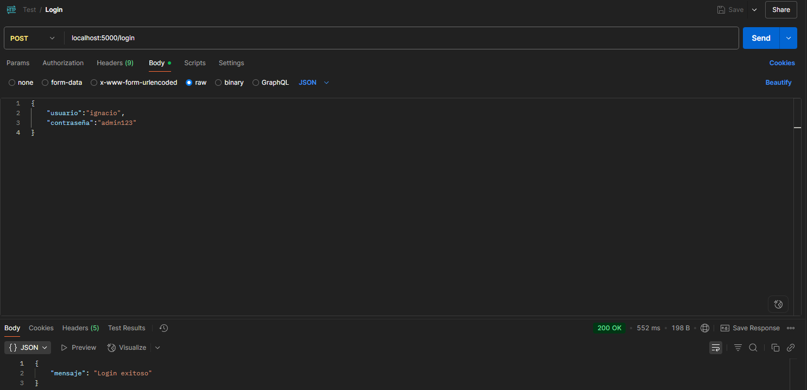
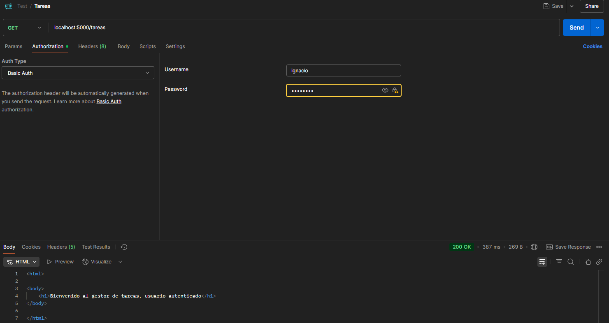

# Programación sobre Redes - PFO 2: Sistema de Gestión de Tareas con API y Base de Datos

## Índice
  - [Objetivos](#objetivos)
  - [Instrucciones para ejecutar el servidor](#instrucciones-para-ejecutar-el-servidor)
  - [Capturas de pantalla de pruebas exitosas](#capturas-de-pantalla-de-pruebas-exitosas)

  - [Preguntas conceptuales](#preguntas-conceptuales)


## Objetivos

1. Implementar una API REST con endpoints funcionales.
2. Utilizar autenticación básica con protección de contraseñas.
3. Gestionar datos persistentes con SQLite.
4. Construir un cliente en consola que interactúe con la API.


## Instrucciones para ejecutar el servidor

### Clonar el repositorio

```bash
git clone https://github.com/ifiora/redes_pfo2
cd redes_pfo2
```

### Crear el entorno virtual

```bash
python -m venv venv
```

### Activar el entorno Virtual

- En Windows:
```bash
venv\Scripts\activate
```

- En Linux/macOS:
```bash
source venv/bin/activate
```

### Instalar dependencias

```bash
pip install -r requirements.txt
```

### Ejecutar el servidor

```bash
python servidor.py
```
El servidor estará disponible en http://localhost:5000

### Ejecutar el cliente
```bash
python cliente.py
```
Podemos usar esta aplicación de consola para registrar usuarios y ver el endpoint de tareas usando un usuario registrado.

## Capturas de pantalla de pruebas exitosas

### Endpoint de Registro



### Endpoint de Login



### Endpoint de Tareas




## Preguntas conceptuales

### ¿Por qué hashear contraseñas?
El hasheo de contraseñas es un proceso unidireccional (no reversible) que permite almacenar las contraseñas en la base de datos sin exponer el valor real de las mismas. Esto hace que aunque alguien consiga acceso a nuestra base de datos no pueda saber cual es la contraseña real de cada uno de los usuarios de una manera trivial.
Por lo tanto el hasheo de contraseñas es una medida de seguridad basica que tenemos que implementar para proteger los datos los usuarios de nuestro sistema.


### Ventajas de usar SQLite en este proyecto
SQLite nos permite generar una base de datos sin tener que instalar un servidor externo, esto es ideal para proyectos pequeños o academicos como este.
También nos guarda toda la información en un solo archivo .db lo que lo hace liviano y portable.
